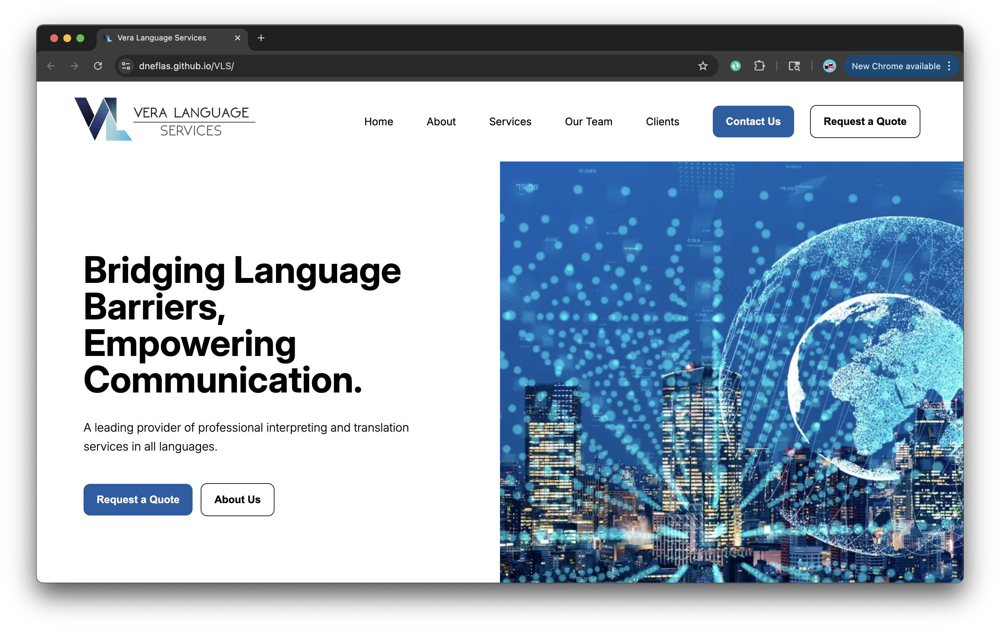

# Vera Language Services (VLS)


VLS is a fully custom website built using **HTML**, **CSS**, **JavaScript**, and **PHP**. It features a contact form with secure SMTP email delivery and clean navigation, intended as a replacement for GoDaddy Website Builder.

---

## 🚀 Table of Contents

- [Live Demo](#-live-demo)
- [Features](#-features)
- [Getting Started](#-getting-started)
- [Setup and Configuration](#-setup-and-configuration)
- [Contact Form](#-contact-form)
- [File Structure](#-file-structure)
- [Deployment](#-deployment)
- [Contributing](#-contributing)
- [License](#-license)

---

## 🎯 Live Demo


[Deployed Application Link](https://dneflas.github.io/VLS/)

---

## ✅ Features

- Fully responsive, handwritten HTML/CSS/JS layout
- Contact form with server-side validation
- Secure SMTP email sending via **PHPMailer** and separate `config.php`
- Redirect to a custom thank-you page after form submission

---

## 🛠️ Getting Started

1. **Clone the repository:**

   ```bash
   git clone https://github.com/dneflas/VLS.git

   ```

2. **Navigate to the public_html/ folder to view or edit the website files.**

## ⚙️ Setup & Configuration

**PHPMailer**
Download the PHPMailer library

Copy the required files (PHPMailer.php, SMTP.php, Exception.php) into public_html/phpmailer/

**SMTP Credentials**
Create a private/config.php outside public_html/

Use this structure:

```<?php
return [
  'smtp_host'       => 'smtp.yourhost.com',
  'smtp_port'       => 587,
  'smtp_user'       => 'you@domain.com',
  'smtp_pass'       => 'your-email-password',
  'smtp_secure'     => 'tls',       // 'ssl' or 'tls'
  'recipient_email' => 'you@domain.com',
];
```

## 📝 Contact Form Handler

- contact.php processes the form
- Sanitizes user input
- Sends email via PHPMailer+SMTP
- Redirects to success.html on success

## 📁 File Structure

```
VLS/
├── private/
│ └── config.php
└── public_html/
├── index.html — Homepage
├── team.html — Team page
├── clients.html — Client Page
├── contact.html — Contact form page
├── quote.html — Quote form page
├── submit-form-handler.php — Form handler
├── success.html — Post-submission page
├── phpmailer/ — PHPMailer classes
└── assets/ — images, CSS, JS
```

## 🔁 Deployment

- Upload contents of public_html/ to your server's public_html/ or www/
- Ensure private/ folder with config.php is outside web root
- Confirm PHPMailer and SMTP are configured correctly

## 🤝 Contributing

Contributions are welcome! Please open issues or submit pull requests for bug fixes or improvements.
